# Expert Printing (Surindo Printing)

Aplikasi Mobile untuk layanan percetakan **Expert Printing** / **Surindo Printing** — Tugas Besar Mata Kuliah Aplikasi Perangkat Bergerak (APB).

Dibangun dengan **Flutter** + **Firebase** + **SQLite** + **Supabase Storage**.

---

## Daftar Isi

- [Fitur Aplikasi](#fitur-aplikasi)
- [Flow Aplikasi](#flow-aplikasi)
- [Teknologi yang Digunakan](#teknologi-yang-digunakan)
- [Struktur Project](#struktur-project)
- [Cara Menjalankan](#cara-menjalankan)
- [Demo / Screenshot](#demo--screenshot)

---

## Fitur Aplikasi

### Role: Admin

| Fitur | Deskripsi |
|---|---|
| **Manajemen Layanan** | Tambah, edit, hapus layanan percetakan (nama, harga, satuan, opsi, deskripsi, status aktif/nonaktif) |
| **Manajemen Cabang** | Tambah, edit, hapus cabang dengan koordinat latitude/longitude dan jam operasional |
| **Manajemen Pesanan** | Lihat semua pesanan, filter berdasarkan status, ubah status pesanan |
| **Alur Status Pesanan** | `Pending` → `Sedang Dicetak` → `Siap Diambil` → `Sudah Diambil` |
| **Notifikasi Real-time** | Mendapat notifikasi saat ada order baru masuk |

### Role: User

| Fitur | Deskripsi |
|---|---|
| **Login & Register** | Login via email/password atau Google Sign-In |
| **Pilih Cabang** | Memilih cabang terdekat sebelum melihat layanan |
| **Browse Layanan** | Melihat daftar layanan yang tersedia di cabang terpilih (dengan infinite scroll) |
| **Detail Produk** | Melihat detail layanan, upload file cetak, atur ukuran & quantity |
| **Keranjang** | Multi-select item, checkout ke cabang yang sudah dipilih |
| **Pesanan** | Tracking status pesanan dengan riwayat status, tandai "Sudah Diambil" |
| **Notifikasi** | Mendapat notifikasi real-time saat status pesanan berubah |
| **Maps** | Melihat lokasi cabang di peta OpenStreetMap, cari cabang terdekat |
| **Profil** | Edit profil (nama, telepon), logout |

---

## Flow Aplikasi

```
Splash Screen
    │
    ├── Session Restore? → Admin → Dashboard Admin
    │                    → User  → Dashboard User
    │
    └── Login Screen
            │
            ├── Login admin (admin / password) → Dashboard Admin
            │
            ├── Login user (email/password)    → Dashboard User
            │
            ├── Login Google                   → Dashboard User
            │
            └── Register → Login Screen
```

### Admin Flow

```
Dashboard Admin
    ├── [Layanan]   → CatalogServicePage (CRUD layanan, assign ke cabang)
    ├── [Cabang]    → BranchManagementPage (CRUD cabang + koordinat map)
    └── [Pesanan]   → OrderManagementPage (filter status, update status)
```

### User Flow

```
Dashboard User (Home)
    │
    ├── Pilih Cabang (wajib, layanan dimuat per cabang)
    │
    ├── Tap Produk → DetailProductScreen
    │   ├── Upload file cetak (PDF/PNG/JPG/DOC, max 25MB)
    │   ├── Atur ukuran & quantity
    │   └── Add to Cart
    │
    ├── [Icon Cart] → KeranjangScreen
    │   ├── Select items
    │   └── Checkout → order dibuat di Firestore + SQLite
    │
    ├── [Tab Maps]  → MapScreen
    │   ├── Lihat cabang di OpenStreetMap
    │   └── Detail cabang + Navigasi
    │
    ├── [Tab Order] → OrderTab
    │   ├── Lihat daftar pesanan
    │   └── Detail + Riwayat status + Tandai "Sudah Diambil"
    │
    └── [Tab Account] → AccountTab
        ├── Lihat profil
        ├── Edit profil
        └── Logout
```

### Alur Checkout

```
Cart → Pilih item → Checkout
    ├── Validasi cabang sudah dipilih
    ├── Validasi layanan tersedia di cabang tujuan
    ├── Upload file ke Supabase Storage (jika ada)
    ├── Simpan order ke Cloud Firestore
    ├── Simpan order ke SQLite (lokal)
    ├── Hapus item dari cart
    └── Kirim notifikasi ke admin
```

### Alur Status Pesanan

```
Pending → Sedang Dicetak → Siap Diambil → Sudah Diambil
   ↑           ↑               ↑
Notif admin  Notif admin    Notif user + notif HP
```

---

## Teknologi yang Digunakan

| Teknologi | Kegunaan |
|---|---|
| **Flutter** | Framework utama aplikasi mobile |
| **SQLite (sqflite)** | Database lokal offline-first (Singleton Pattern) |
| **Firebase Authentication** | Login email/password & Google Sign-In |
| **Cloud Firestore** | Database cloud untuk sync data real-time |
| **Supabase Storage** | Upload file cetak (PDF, gambar, dokumen) |
| **flutter_map + OpenStreetMap** | Peta & navigasi cabang |
| **Geolocator** | Deteksi lokasi pengguna |
| **file_picker** | Upload file dari perangkat |
| **Google Sign-In** | Opsi login dengan akun Google |

---

## Struktur Project

```
Tubes_APB/
└── expert/
    ├── lib/
    │   ├── main.dart                         # Entry point Flutter
    │   ├── auth/
    │   │   ├── splash_screen.dart            # Splash + session restore
    │   │   ├── login_screen.dart             # Login (admin/user/Google)
    │   │   └── register_screen.dart          # Register akun baru
    │   ├── admin/
    │   │   ├── dashboard_admin.dart          # Dashboard admin (3 menu)
    │   │   ├── catalog_service.dart          # CRUD layanan
    │   │   ├── branch_management_page.dart   # CRUD cabang
    │   │   └── order_management_page.dart    # Manajemen pesanan
    │   ├── user/
    │   │   ├── dashboard.dart                # Dashboard user (home)
    │   │   ├── detailProduct.dart            # Detail produk + upload file
    │   │   ├── keranjang.dart                # Keranjang + checkout
    │   │   ├── pilih_cabang.dart             # Pilih cabang checkout
    │   │   ├── order_tab.dart                # Daftar pesanan user
    │   │   ├── order_detail.dart             # Detail + riwayat pesanan
    │   │   ├── notifikasi.dart               # Notifikasi user
    │   │   ├── account_tab.dart              # Profil & edit profil
    │   │   └── product_image.dart            # Widget gambar produk
    │   ├── data/
    │   │   ├── database_helper.dart          # SQLite Singleton (semua CRUD)
    │   │   ├── models.dart                   # Semua model + SessionManager
    │   │   ├── firestore_database_service.dart  # Firebase Firestore service
    │   │   ├── firebase_auth_service.dart    # Firebase Auth service
    │   │   ├── app_session_service.dart      # Session restore management
    │   │   ├── time_utils.dart               # WIB time utils + BranchSchedule
    │   │   ├── order_file_upload_service.dart # Upload file ke Supabase
    │   │   ├── order_file_rules.dart         # Validasi file upload
    │   │   └── supabase_storage_config.dart  # Konfigurasi Supabase
    │   └── maps/
    │       ├── map_config.dart               # Konfigurasi OpenStreetMap
    │       ├── location_access.dart          # Izin lokasi
    │       ├── models/branch.dart            # Model Branch untuk maps
    │       ├── screens/
    │       │   ├── map_screen.dart           # Peta interaktif
    │       │   ├── branch_detail_screen.dart # Detail cabang
    │       │   └── navigation_screen.dart    # Navigasi ke cabang
    │       └── widgets/
    │           └── map_tile_error_overlay.dart
    ├── assets/
    │   └── logo.jpeg
    ├── tool/
    │   ├── run_android.ps1
    │   ├── convert_catalog_to_webp.mjs
    │   ├── import_product_catalog.mjs
    │   └── firebase/
    │       ├── firestore_seed.json
    │       ├── import_firestore.mjs
    │       └── serviceAccountKey.json
    ├── pubspec.yaml
    └── backend_qa_presentation.md
```

---

## Cara Menjalankan

### Prerequisites

- Flutter SDK (>3.0)
- Firebase project (untuk Auth & Firestore)
- Supabase project (untuk file storage) — opsional
- OpenStreetMap (gratis, tanpa API key)

### Setup

1. Clone repositori
2. Buat file `google-services.json` dari Firebase Console dan letakkan di `android/app/`
3. Jalankan Flutter:

```bash
cd Tubes_APB/expert
flutter pub get
flutter run
```

### Login

| Role | Email | Password |
|---|---|---|
| **Admin** | `admin` | `password` |
| **User Dummy** | `user@expert.com` | `password` |
| **User Baru** | Register via aplikasi | - |

> Data dummy (user, layanan, cabang) akan otomatis terisi saat pertama kali aplikasi dijalankan berfungsi seeder di SQLite.

---

## Demo / Screenshot

Screenshot hasil run aplikasi disimpan pada folder `screenshots/`.

### Login Screen

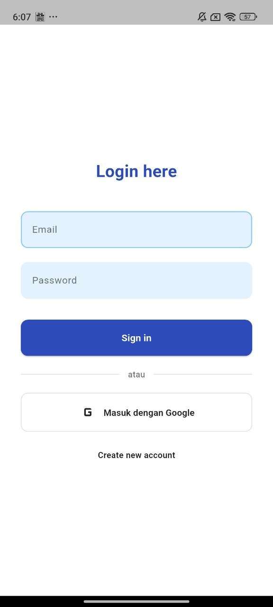

*Halaman login dengan opsi Sign In menggunakan email/password, masuk dengan Google, dan navigasi ke halaman Register.*

### Register Screen

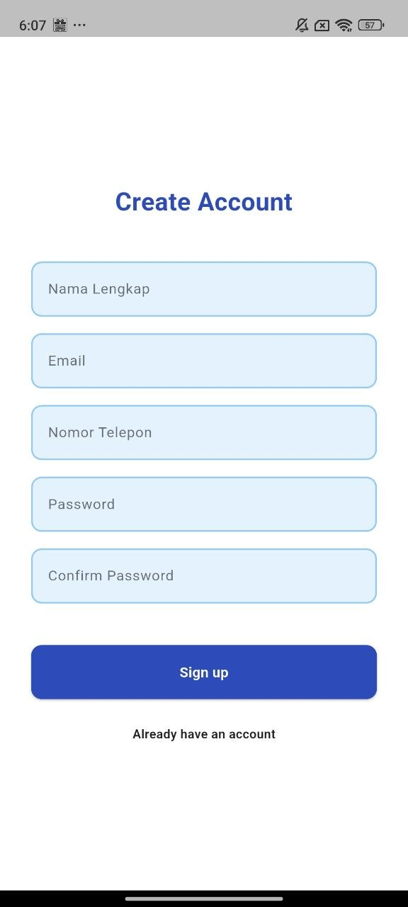

*Form pendaftaran akun baru dengan field Nama Lengkap, Email, Nomor Telepon, Password, dan Confirm Password.*

### Dashboard User

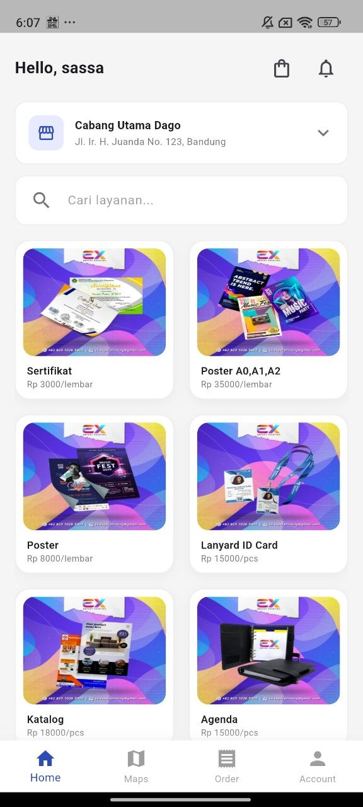

*Halaman utama user setelah login. Menampilkan sapaan, pemilih cabang, search bar, dan grid layanan yang tersedia.*

### Pilih Cabang

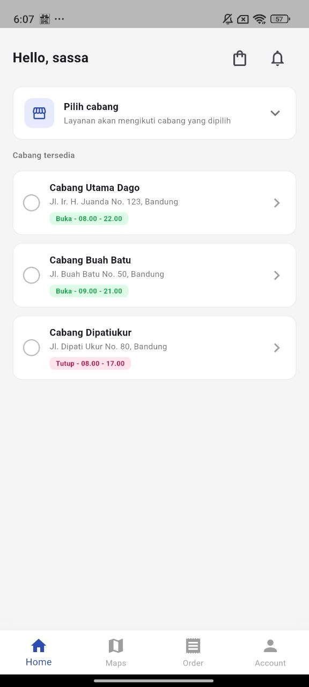

*Halaman pemilihan cabang. User dapat memilih cabang berdasarkan nama cabang, alamat, dan status operasional.*

### Detail Produk

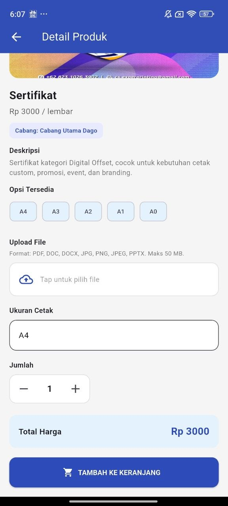

*Halaman detail layanan percetakan. User dapat melihat detail layanan, mengatur pesanan, dan menambahkan item ke keranjang.*

### Keranjang

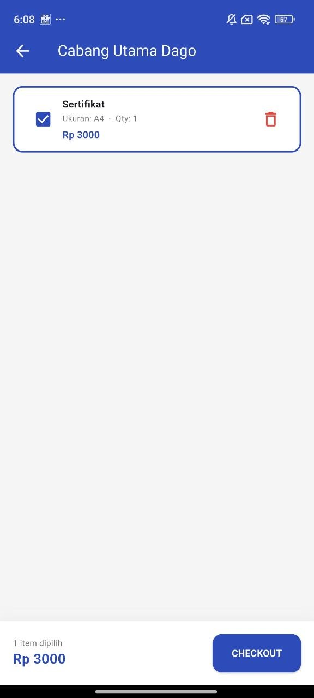

*Halaman keranjang berisi daftar item pesanan user, total harga, dan proses checkout.*

### Pesanan User

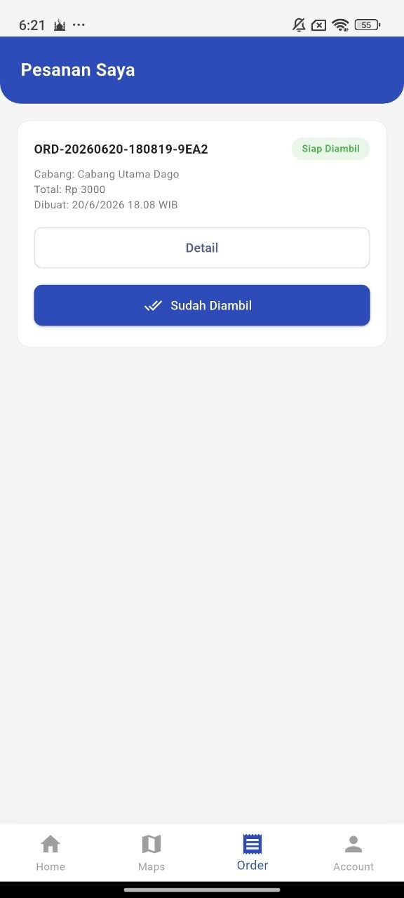

*Daftar pesanan user yang menampilkan status pesanan, cabang, total harga, dan akses ke detail pesanan.*

### Detail Pesanan

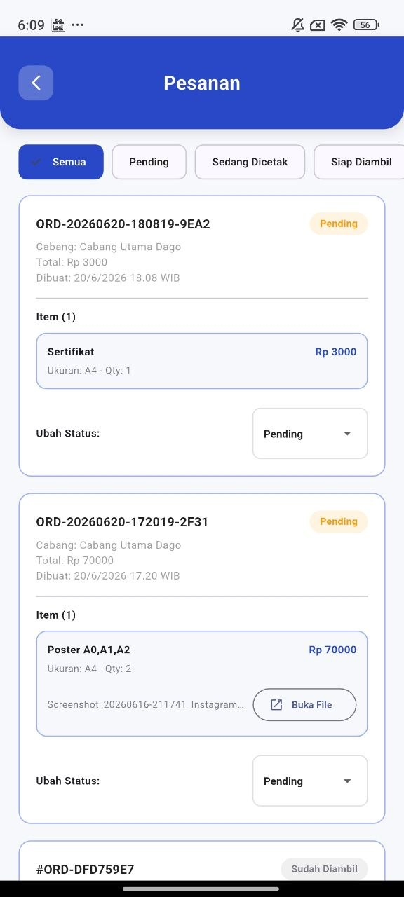

*Halaman detail pesanan yang menampilkan informasi pesanan, item pesanan, status, dan riwayat proses pesanan.*

### Notifikasi

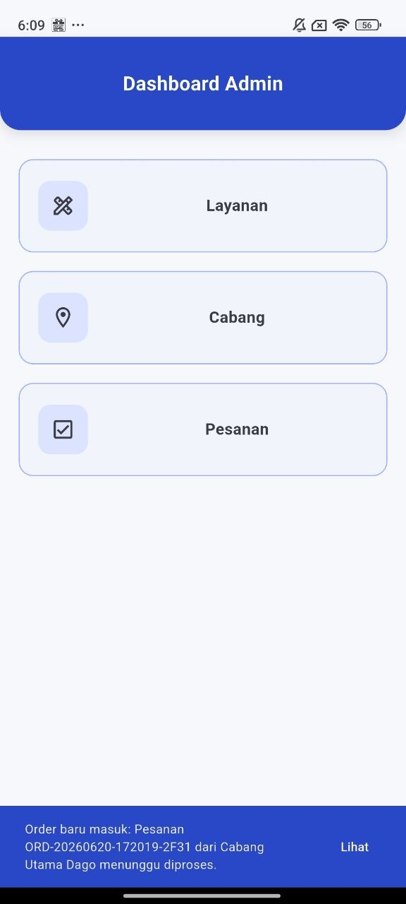

*Halaman notifikasi user. Notifikasi ditampilkan saat terdapat perubahan status pesanan.*

### Maps Cabang 1

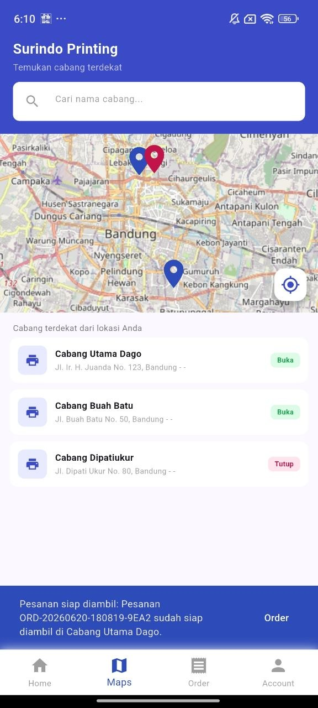

*Tampilan peta cabang menggunakan OpenStreetMap untuk menampilkan lokasi cabang.*

### Maps Cabang 2

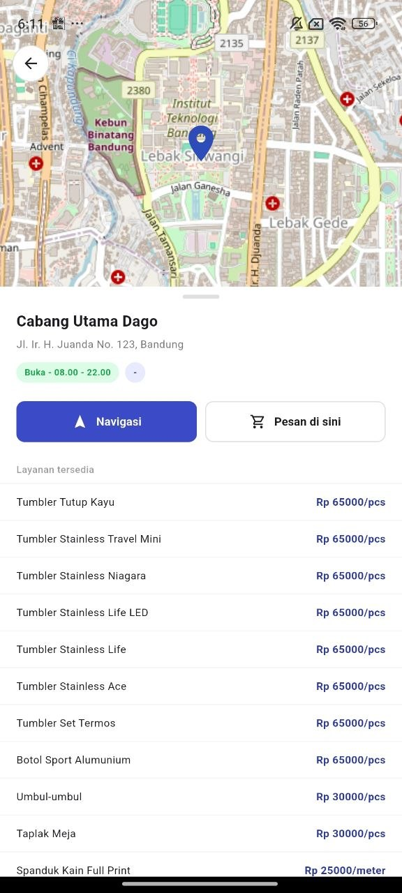

*Tampilan lanjutan fitur maps untuk melihat detail lokasi cabang.*

### Maps Cabang 3

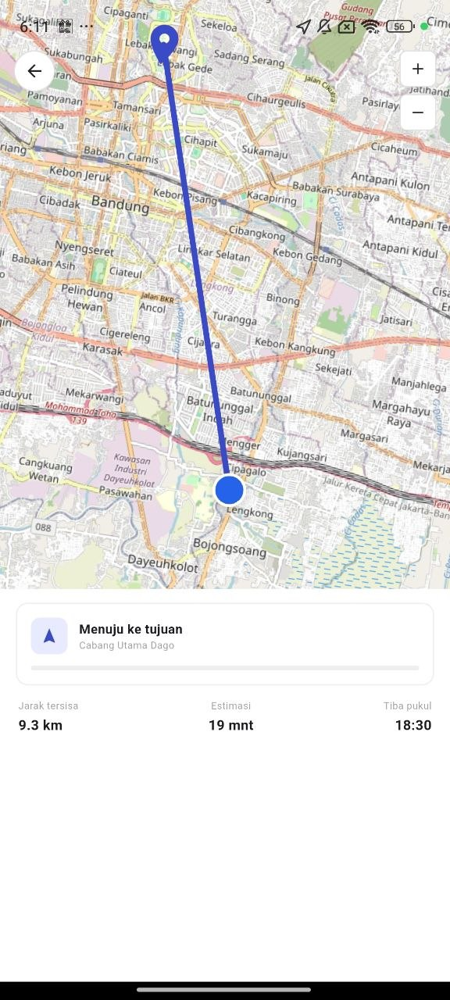

*Tampilan fitur maps lainnya yang mendukung user dalam melihat atau memilih lokasi cabang.*

### Dashboard Admin

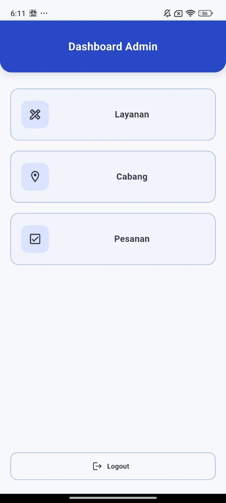

*Halaman utama admin dengan menu pengelolaan layanan, cabang, dan pesanan.*

### Manajemen Layanan Admin

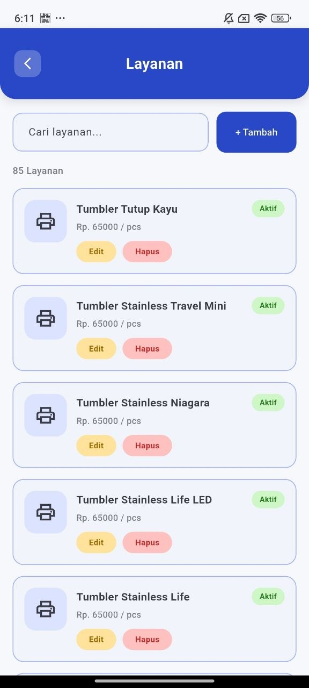

*Admin dapat melihat dan mengelola daftar layanan percetakan.*

### Form Layanan Admin

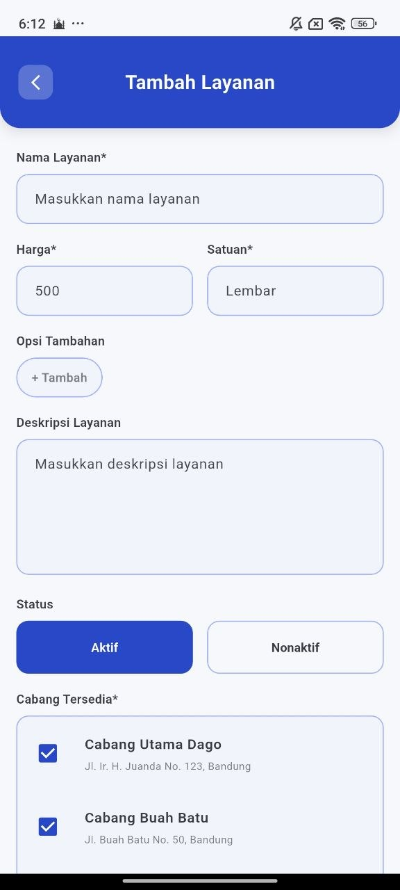

*Form untuk menambah atau mengedit layanan percetakan, seperti nama layanan, harga, deskripsi, dan status layanan.*

### Manajemen Cabang Admin

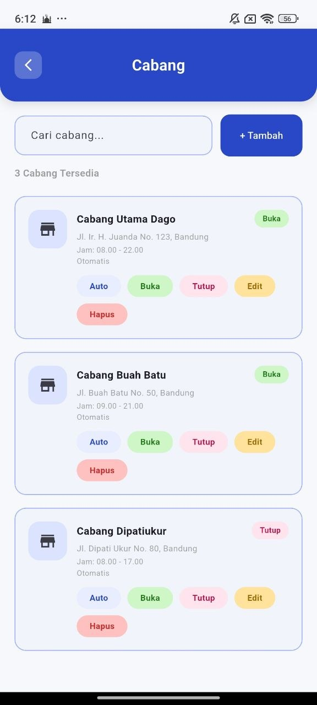

*Admin dapat menambah, mengedit, dan menghapus data cabang serta mengatur informasi operasional cabang.*

### Manajemen Pesanan Admin

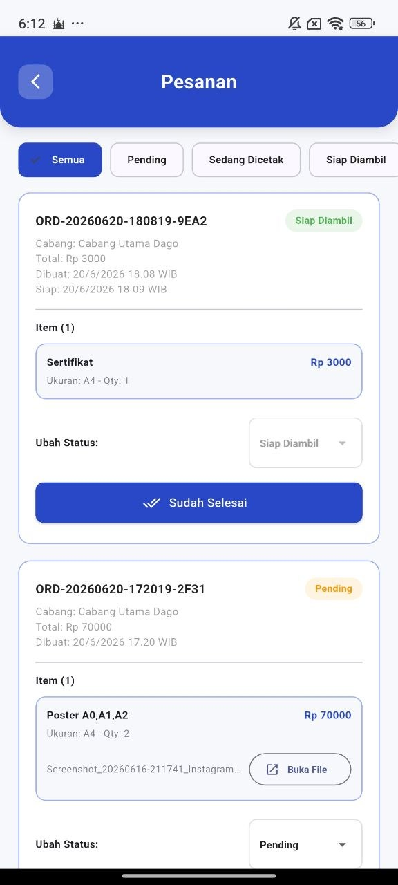

*Admin dapat melihat daftar pesanan, memfilter status pesanan, dan memperbarui status pesanan.*

### Profil User

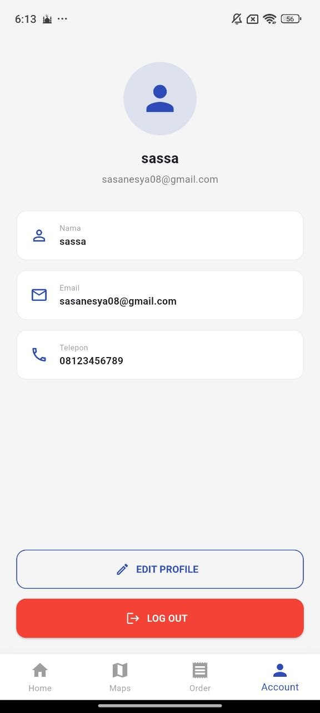

*Halaman profil user yang menampilkan informasi akun seperti nama, email, nomor telepon, serta opsi edit profil dan logout.*


---

## Catatan

- **Database**: Aplikasi menggunakan SQLite sebagai primary database lokal dan Cloud Firestore untuk sync cloud. Pada mode offline, data tetap bisa diakses dari SQLite.
- **File Upload**: File cetak diupload ke Supabase Storage. Jika Supabase belum dikonfigurasi, checkout tetap berjalan tanpa upload file.
- **Maps**: Menggunakan OpenStreetMap (gratis, tanpa API key). Jika tiles tidak bisa dimuat, overlay error akan muncul.
- **Waktu**: Semua waktu menggunakan zona WIB (UTC+7).

---

*Tugas Besar Aplikasi Perangkat Bergerak — 2026*
